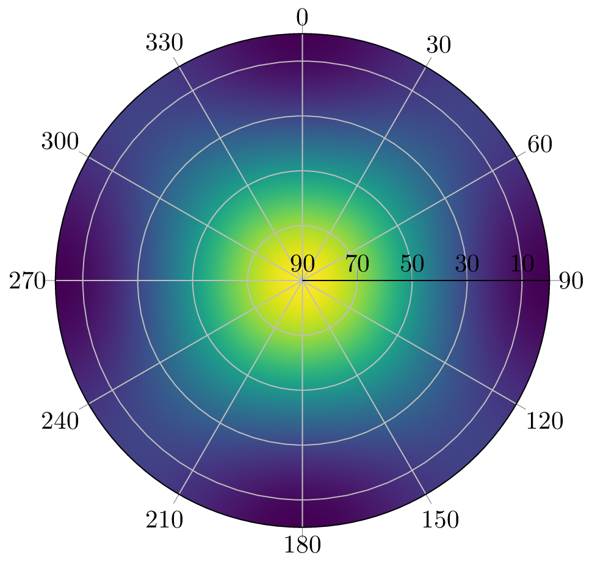
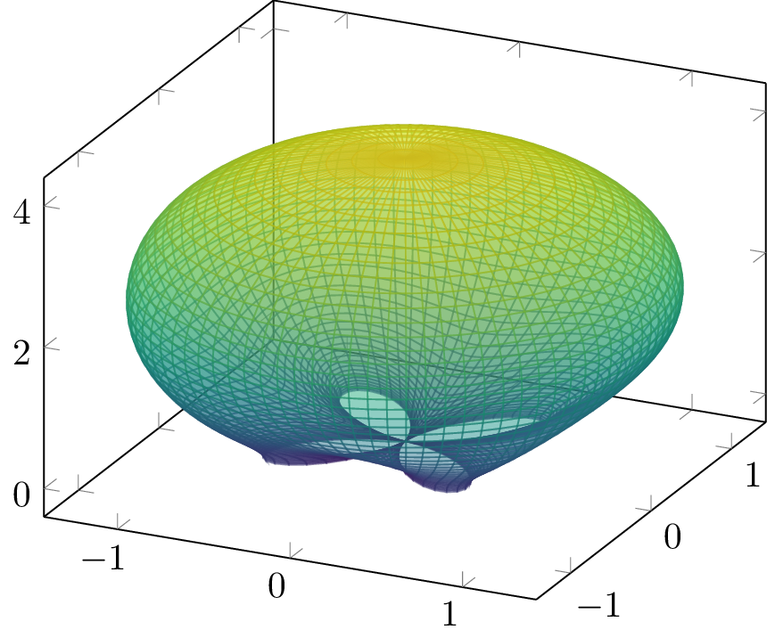

[](https://git.rwth-aachen.de/nav/PhasedArray.jl/commits/master)
[](https://git.rwth-aachen.de/nav/PhasedArray.jl/commits/master)
# PhasedArray.jl
This module provides common functions associated with antenna arrays.
Currently it provides the creation of antenna array manifolds of ideal antennas and / or of measured steering vectors based on Look-up-Tables (LUT).

## Features

 * Easy access to antenna array manifolds either ideal or real
 * Create patterns

## Getting started

Install:
```julia
import Pkg
Pkg.add("git@git.rwth-aachen.de:nav/PhasedArray.jl.git")
```

## Usage

### Ideal manifold
You can either create an ideal manifold based on antenna positions and center frequency
```julia
using PhasedArray, StaticArrays
antenna_positions = 0.1904 / 4 *
    @SMatrix [1 -1  1 -1;
              1  1 -1 -1;
              0  0  0  0]
manifold = IdealManifold(1575420e3, antenna_positions)
doa = @SVector [0, 0, 1]
steer_vec = get_steer_vec(manifold, doa)
```
### Real manifold
or you can create a real manifold based on a measured LUT:

```julia
using PhasedArray, StaticArrays
manifold = RealManifold(lut, PhasedArray.NumAnts(4))
steer_vec = get_steer_vec(manifold, SVector(0, 0, 1))
```
The LUT can either be a 3D Array, where the first dimension holds the antenna channels, the second dimension the elevations and the third dimension the azimuths, or it can be a `SVector` of a matrices, where each matrix holds the elevations on the first dimension and the azimuths on the second dimension per antenna channel.
If you pass a 3D Array, you must also provide the `NumAnts(num_ants)` argument.

The interpolation can be set with the interpolation argument. The default one is `Constant`. You can change that to `Linear` or `Quadratic`, if you'd like to.

By default the LUT is normalized to its highest gain. If you don't want that, you can pass the argument `normalize = false` to the `RealManifold` function. 

The function `get_steer_vec` has an optional third argument for a rotation matrix, if you'd like to rotate the Direction of Arrival (DoA) before looking up the steering vector.

## Plotting

This module also provides some helping functions, if you'd like to plot a pattern

### 2D Pattern

A 2D pattern can be generated with:
```julia
reduce_ant_function = norm
pattern = Pattern(manifold, reduce_ant_function, num_az = 360, num_el = 91, max_el = π / 2)
```
The `reduce_ant_function` can be any function, that reduces the antenna channels to a scalar real value.

This pattern can be plotted with Plots.jl in the following way:
```julia
using Plots
plot(pattern)
```

Alternatively you can plot it with PGFPlotsX:
```julia
using PGFPlotsX
@pgf PolarAxis(
    {
        ymin = 0,
        ymax = pattern.max_el * 180 / π,
        "colormap/viridis",
        "axis on top",
        "colorbar style={title=Amplification (dB)}",
        xticklabel = "{\$\\pgfmathparse{Mod(90-\\tick,360)}\\pgfmathprintnumber{\\pgfmathresult}\$}",
        yticklabel = "{\$\\pgfmathparse{90-\\tick}\\pgfmathprintnumber{\\pgfmathresult}\$}",
    },
    Plot3({surf, shader="interp"},
        Coordinates(pattern.azs .* 180 ./ π, pattern.els .* 180 ./ π, pattern.values')
    )
)
```

### 3D Pattern
If you'd like to plot a 3D figure, this can be done with the following code:
```julia
reduce_ant_function = norm
pattern = Pattern3D(manifold, reduce_ant_function, num_az = 360, num_el = 181, max_el = π)
```
Again, this can be plotted with Plots.jl:
```julia
using Plots
plot(pattern)
# If you use plotlyjs() you can also plot the gain correctly:
# plot(pattern, fill_z = pattern.gains)
```

Alternatively you can plots the pattern with PGFPlotsX in the following way:
```julia
using PGFPlotsX
@pgf Axis({"colormap/viridis"},
    Plot3({surf, "z buffer=sort", "opacity=0.5", "point meta=sqrt(x^2+y^2+z^2)"},
        Table([:x=>vec(pattern.X), :y=>vec(pattern.Y), :z=>vec(pattern.Z)]; scanlines = size(pattern.X,1))
    )
)
```


## License

MIT License
