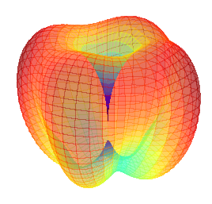

[](https://git.rwth-aachen.de/nav/PhasedArray.jl/commits/master)
[](https://git.rwth-aachen.de/nav/PhasedArray.jl/commits/master)<br/>


# PhasedArray.jl
This module provides common functions associated with antenna arrays.
Currently it provides the creation of antenna array manifolds of ideal antennas and / or of measured steering vectors based on Look-up-Tables (LUT). Moreover it provides some nice plotting functionality.

## Features

 * Easy access to antenna array manifolds either ideal or real
 * Various plots

## Getting started

Install:
```julia
Pkg.clone("git@git.rwth-aachen.de:nav/PhasedArray.jl.git")
```

## Usage

Create 3D pattern plot:
```julia
using PhasedArray
using PyPlot
ant_pos = 0.1904 / 4 * [1 -1 1 -1; 1 1 -1 -1; 0 0 0 0]
get_steer_vec = manifold(ant_pos, 1575420e3)
example_steer_vec = get_steer_vec([0,0,1])
plot_pattern_3D(figure(), (1,1,1), get_steer_vec)
```

Create animation with jammer:
```julia
using PhasedArray
using PyPlot
ant_pos = 0.1904 / 4 * [1 -1 1 -1; 1 1 -1 -1; 0 0 0 0]
get_steer_vec = manifold(ant_pos, 1575420e3)
animate_pattern_data = init_animate_pattern_data(get_steer_vec)
animate_pattern(figure(), (1,1,1), animate_pattern_data)
```

or based on a LUT:

```julia
using PhasedArray
using StaticArrays
using MAT
file = matopen("example_LUT.mat")
lut = read(file,"LUT_name")
close(file)
get_steer_vec = manifold(lut)
example_steer_vec = get_steer_vec(SVector(0,0,1))
plot_pattern_3D(get_steer_vec)
```
## License

MIT License
